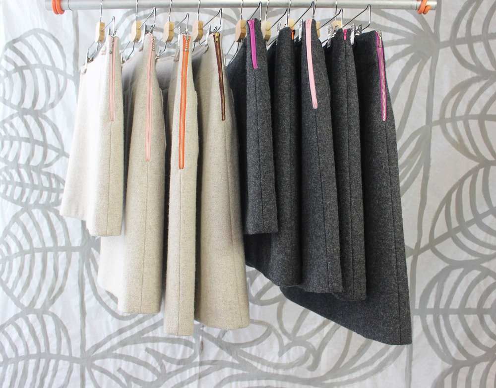
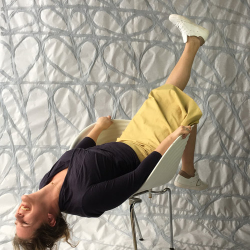

<site peppertom> Pepper+Tom

<logo> 

<copyright> Pepper+Tom

<page index> Home

# Home

## Cool clothes. Designed styles. Sustainable materials. Fair trade. Slow fashion. Pepper+Tom makes it work. 

Pepper+Tom clothes are sold by:

Unfold | Markt 27 | 2611GP Delft | The Netherlands | Telephone +31 15 214 11 51 | E-mail info@unfold-delft.nl | Site unfold-delft.nl

<page products> Products

## Desirable products

Where do clothing and fabrics come from? Who made them and under what circumstances? Often there is no answer to these questions, even when asking them in expensive stores.

Wouldn’t it be nice to wear clothes where it is clear who made them? Where the conditions of fabrication are good and the trade is fair?  

Pepper+Tom wants that, sharing experience, collaborating with partners in the clothing chain, who think and act the same way. To make the production, resources and materials traceable for every garment. Pepper+Tom supports the idea of ‘true cost’ and ‘slow fashion’, adding to the pleasure of wearing the clothes.

# Skirts





















Pepper+Tom skirts are perfect basic items that should not be missing in your wardrobe. They are designed in various sizes, fabrics (cotton, silk and wool) different lengths and delicately finished with a colored zipper. The skirts are made from sustainable fabrics. Semi couture by a Dutch Atelier. 

Confident women accentuate their individuality with their outfit. Cowboy boots under a fashionable skirt. High heals under a loose dress or pants. They combine stylish and tough. They choose for comfort above catwalk, appreciating beautiful and well-made garments. They opt for Pepper+Tom.

Quote’s by Pepper+Tom customers:
‘It’s a simple style, good model, clear!’
‘I can wear it all day, all night, everywhere’
‘Very flattering to many figure types’

Pepper+Tom would like to say to all women:
‘Just keep dancing!’

# Scarves







The scarves are the result of many peoples’ work and creativity from rural Bangladesh to the cities of the Netherlands and the shores of the United States.

Beautiful women of Bangladesh embroider the scarves by using the traditional Nakshi Kantha technique. The silk of the scarves is made of the best quality, Rajshahi Silk. The fabric is embossed in a workplace in Dhaka and embroidered in Dinajpur, a poor region in the northwest of Bangladesh.

All under supervision of Kumudini Welfare Trust of Bengal. This NGO is part of the World Fair Trade Forum and Ecota Fair Trade Forum. In 2008 they received the Award of Excellence for Handicrafts South Asia from Unesco.

Under the name of Generous Gesture, the scarves have won a Bronze Award for the European Design Award 2010 in the category ‘Self Initiated Projects’

Generous Gesture has been nominated for the German Design Award 2012.

# Skirts

## Spring summer

## A-line skirt
























## Handpainted skirt | A unique piece










## A-line skirt | close ups









## Fabrics

Capsicum natuurstoffen Capsicum natuurstoffen is a Dutch initiative that uses eco cotton, handwoven in Kerala, India. This handwoven fabric consists of small inconsistencies, a characteristic of the handcrafted process. Zippers are source from Italian brand Lampo, certified by Oeko-Tex Standard 100. Capsicum has developed an environmentally friendly production process, they encourage their producers to improve working conditions and strive to pay their workers a fair wage.

In addition to the cottons, Capsicum promotes handwoven silk from Bangkok, Thailand, cooperating with a family business for over 30 years.

Pepper+Tom source their eco cotton and ink from Ecological Textiles for their hand painted skirts. This firm offers a wide range in fabrics, yarns and dyes that are manufactured and processed in a sustainable way. Ecological Textiles stands for environmentally sound production, fair trade and top quality.

From threads to fabrics, from moulding to materials our products comply with all European environmental, occupational safety laws and respect for the workers.

## Wash instructions

Eco cotton Machine wash 40C, ironing, do not bleach, no tumble-dry. Handle with love and care.

Silk Wash gently only by hand, ironing, do not bleach, no tumble-dry. Handle with love and care.

## Prices

Because every skirt is a unique piece there is a variety of prices. Visit the UNFOLD store in Delft for all the skirts they have in store. Or call/email Pepper+Tom for orders and prices on request.  

# Scarves

The shawl is a gift. By giving it, the giver wants to tell something to someone, “I give this unique shawl to my...”. For the receiver it is a way of expression. Depending on how the shawl is folded, emphasis is on either the alliterating typography or the decorative leaves. A new image every time as personal gift. To someone. Or to yourself. The scarves are hand made in a limited edition.












Scarf ‘Wonderful Woman’, ‘Lovely Lover’, ‘Marvelous Mother’ and ‘Fabulous Friend’

Price €199,-

Fabrics The shawls are produced in block-print, provided with an embroidered frame, the material is silk, and they measure 20 x 80 inch (50 x 200 cm). The shawls are made of Rajshahi Bengali silk, woven by the shot or changeant technique. If the fabric moves the color changes and is continuously different. The clarity of the colors is extraordinary!

Typeface Productus is a design by Petr van Blokland, published by TYPETR - TypeNetwork in New York.

Washing Handle with love and care. Wash gently by hand in hand-warm water with detergent for silk. Ironing. Do not bleach, no tumble-dry.




Scarf ’Gentle Gent’

Price €199,-

Fabrics The shawls are embroidered by hand. Double layered fabrics of silk and cotton. They measure 12 x 65 inch (30 x165 cm). The silver colored silk is made of the best Rajshahi Bengali silk. The off-white cotton is eco friendly produced.  

Typeface Village is a design by David Berlow, published by Font Bureau - TypeNetwork in New York

The scarf says ‘Gentle Gent’ in Latin (English) and in Bengali. Jo de Baerdemaker a typedesigner from Belgium was very helpful with the Bengali type. Visit www.typojo.com to learn more about his work.

# Notes

Pepper+Tom's Refuge
May 12, 2017
Retreat: Rediscover-, Redefine-, Release- and Remodel time, with a sense of humor.

Wellspring
April 25, 2017
Animated by quotes of Sir Francis Bacon (British painter 1909-1992)
“‘By far the best proof is experience’ ”
— Sir Francis Bacon

“In order for the light to shine so brightly, the darkness must be present”
— Sir Francis Bacon

Happy Easter
April 11, 2017
'It’s A Good Week To Have A Good Week And A Happy Easter'

# Contact

Love to hear from you...

Claudia Mens | claudia@petr.com 

mobile +31 6 41 367 689 | studio +31 15 887 1233

Rietveld 56 | 2611 LM Delft | The Netherlands

129  Indian Hill Road | 02575 West Tisbury Martha's Vineyard | USA

The company is registered in the Chamber of Commerce (Handelsregister Kamer van Koophandel), by name Buro Petr van Blokland + Claudia Mens, number 27237753 Delft. If you have a question not answered in this website, you can send an email (claudia@petr.com) and we will respond to you as soon as we can. 

# Studio

Pepper+Tom is initiated by Claudia Mens, located at Rietveld 56, 2611 LM in Delft, The Netherlands. 

Telephone mobile +31 6 41 367 689 or studio +31 15 887 1233

Pepper+Tom would never exist without a team of dedicated people. 

Claudia Mens claudia@petr.com  Designer, founder Pepper+Tom 

Petr van Blokland Typedesigner

Kirsten Langmuur Graphic designer

Liesbeth Oltmans Designer, consultant, trendwatcher

Djoeke Delnooz Model

Libby Ellis Creative director 

Sep Schaffers Text writer

Marlies Kromwijk Designer sustainability 

Petra Dijkgraaf Tailor

Suzanne Liem Photographer

Pendleton, Boweevil, Capsicum, Ecological Textiles and Bottger Fabric suppliers

Claudia Mens

I am the child of the woods.
We lived in a wooden house. At a dirt road.
Endlessly tinker with acorns.
Myself hiding under the ferns.
Preferably in a sweater and pants.
Wow, what a freedom, what a space.
Always together with other kids.

“Watching is a verb,” my mother would say “look at the world. Look how beautiful that portrait has been painted.”
I drew notebooks. Making atmospheres and environments, little peepshows. Then crept behind my mom’s Husqvarna sewing machine and sewed a wide comfy skirt. To climb into trees.

After three decades, running a studio from 1980 till 2010, it was time for something else. Claudia went looking and longing for the woods of her childhood. She found that feeling back on Martha's Vineyard in the USA, where she began drawing with childlike pleasure and painting. Arose leafs and fern motifs, inspired by her travels in Africa, South America and Asia.

She designed a series of scarves with type and motifs of leafs, produced by NGO Kumudini Welfare Trust in Bangladesh. In 2016, she started with a lot of spirit and fun Pepper+Tom.

Besides the products of Pepper+Tom, similar to work in all of the photo's on this website, design can be made by Claudia as a special custom assignment. Ask her: claudia@petr.com

# Stores

Unfold | Markt 27 | 2611GP Delft | The Netherlands | Telephone +31 15 214 11 51 | E-mail info@unfold-delft.nl | Site unfold-delft.nl

Brickyard | 19 Main Street | Vineyard Haven | United States | Telephone +1 508 338 2178 |  Site brickyardmv.com  

# Lookbook

Grand Old Lady, an Archetype in the City

Edward Hopper, Hero of light, color, desolation

Scarlet runner beans’ color palet

Charlotte Brontë, more than a wonderful writer

Skirt reaching the beach, always so good to be there. | MV

Surface, light, reflection

Weathered skin

Results of planting, nurturing, harvesting. Mannequins at the Agricultural Fair | MV | US 

Russel Wright’s joy of interior experiments at Manitoga  | Garrison | NY

Good Old Delft | NL

Tactility of Richard Serra’s corten steel bodies

Sketchbook | Claudia Mens

Spring in Vermont | US 

Still life at Putney School | Vermont | US

Passing a garbage bin

Zinnias, the Summer Souls

Coop creations

Gouache on pattern paper by Claudia Mens 

Wall detail at the Russel Wright Foundation, pine 
needles and concrete | Garrison | NY 

Sol LeWitt, achromatic scheme | DIA Beacon | NY 

Reused fabrics reminding of Gustav Klimt | Cooper Hewitt Museum | NYC 

Generous Gesture | Who’s the Dandy? | Embroidered Nakshi Kantha

Fall in the dunes, Wassenaar | NL 

Skirt on her way to the beach | Martha’s Vineyard | US

Meeting peaceful flags on a morning walk | North Hampton | US

Powerful Aboriginals | AAMU Museum | Utrecht | 
NL

Embroidered type | Generous Gesture

Hanging in the balance | Alexander Calder | Witney Museum | NYC

Knitting Madison Square by Daniella on Design | NYC

Shop window in Antwerp | Belgium 

Cut out paper, the background appears

Skirt at work | Chilmark MV

Layers, always intriguing | Edgartown MV

Love the contrast, love the matching | Menemsha MV

Playing with card board, marker and crayons

Leafs and light

Thank you sunlight!

Sure?!

Staircase wall | Van Gogh Museum | Amsterdam

Beach fun, no lifeguards around... | MV

Impressed by Ursula von Rydingsvard and Alexander Calder at Storm King | NY

Design thru light

Inspired by light, reflection, color | Robert Irwin | DIA Beacon | NY

Reflections

Ice design

Calder meets the Hudson Valley | Alexander Calder | Storm King | NY

Lift your head once in a while, you will love it!

Cutting paper letters

Color and character

Generous Gesture | Embroidered Nakshi Kantha | Detail Latin and Bengali type

Doubled

Old meets new | Ceiling Cooper Hewitt Museum | NYC

Grey tones

A repoussoir for Pepper+Tom | MV

Black and white, so strong together

So beautiful to get older

Pepper+Tom skirt having fun at home

Reused fabric | Cooper Hewitt Museum | NYC

Above your head in ABC CARPET & HOME | NYC

Behind the physical object

Rusted TYPETR Promise type in ’s Hertogenbosch | NL

Friendly Guy in the City

# Notes + news

### Pepper+Tom's Refuge
May 12, 2017
Retreat: Rediscover-, Redefine-, Release- and Remodel time, with a sense of humor.

'Heaven just Heaven'
'Where's my dog?










### Wellspring
April 25, 2017
Animated by quotes of Sir Francis Bacon (British painter 1909-1992)
“‘By far the best proof is experience’ ”
— Sir Francis Bacon











“In order for the light to shine so brightly, the darkness must be present”
— Sir Francis Bacon







###Happy Easter

April 11, 2017
'It’s A Good Week To Have A Good Week And A Happy Easter'

The Sanctuary, a magic place | MV | US

Yellow on the go!

A good color combi

Inspired by..
April 04, 2017
Inspired by Imaging, Illusion, Illumination

Longing

The arrival of Spring in Wolgate | Detail | David Hockney

Trompe l’oeil

### Vivienne Westwood message for life

March 29, 2017
Westwood Studios - CR Talk IOU meeting

https://www.youtube.com/watch?v=BXClZ9Itc3M&feature=emb_logo

“Message for life; ‘I must try to understand the world I live in and make use of my life”
— Vivienne Westwood

“Don’t invest in fashion invest in the world”
— Vivienne Westwood
Tags: inspiration, design
 Comment   0 Likes  
Share
Pepper+Tom at the Unfold fashion show
March 22, 2017 in skirts
Our haindpainted skirt at the Unfold Fashion show.

Fashion show at Unfold
March 15, 2017 in skirts, Inspiration
Sunday March 19th Fashion show at Unfold with a range of Dutch brands included Pepper+Tom. Seats still available for the show at noon, so run to sign up!

Spring is in the air!
February 21, 2017 in skirts, design process, Inspiration
We are working on a new series of skirts in beautiful silk and cotton fabrics from India and Thailand. Of course, all eco friendly, sustainable and traceable. More information about these terrific suppliers very soon.

We’re exited to give you a sneak preview on the new color scheme of happy greens, spicy yellows and rustic khakis. We hope you’ll like it.









Tags: inspiration, sketching, skirts, eco cotton, happy green, spicy yellow, rustic khaki
 Comment   1 Likes  
Share

#### Get prepared for Spring!
February 13, 2017 in skirts, scarfs
When you feel ready to show up with this lovely skirt, visit UNFOLD, the fabulous fashion store in Delft.http://www.unfold-delft.nl

A hand painted off-white skirt eco cotton with Cupro lining (Cupro is a eco friendly cellulose fiber) will be tailor-made for you.

You can chose 'Milady Ton-Sur-Ton' (white on off-white) or 'Milady In-your-Face' (black on off-white). Knee or calf length.






### New arrival | handpainted skirt
February 08, 2017 in design process
For all you lovely lovers








### Hand painted skirts
January 31, 2017 in design process
For upcoming February 14th; let’s embrace ‘the day of love’. Love in general, for every beautiful person on this planet!

‘Who does good, meet good’ Wonderful Women, Marvelous Mothers, Gentle Gents, Glorious Girls, Lovely Lovers, have a nice day!









### Buy less, choose well

January 17, 2017
“Buy less. Choose well. Make it last. Quality, not quantity. Everybody’s buying far too many clothes.”
— Vivienne Westwood







Learning by looking+listening
January 10, 2017
Focus groups




Pepper+Tom feels privileged to work with a dedicated group of women. They give feedback, valuable information about what women want. We believe this is the best way to improve the design of the skirts.
“The brand is not a product, it’s the relationship that you build with your customer. The product is just the start, a conversational piece.”
— Maker’s row
Tags: design process, design
 Comment   0 Likes  
Share

### Looking for a thoughtful Christmas present?
December 22, 2016 in Inspiration




Give one of our beautiful hand embroidered scarfs to that special someone. 

The shawl is a gift. By giving it, the giver wants to tell something to someone, “I give this unique shawl to my...”. For the receiver it is a way of expression. Depending on how the shawl is folded, emphasis is on either the alliterating typography or the decorative leaves. A new image every time as personal gift. To someone. Or to yourself. The scarves are hand made in a limited edition.

The Generouse Gesture scarfs are available at Unfold in Delft (www.unfold-delft.nl) and Brickyard in Vineyard Haven (www.brickyardmv.com)
Tags: scarfs, gift, fairtrade
 Comment   1 Likes  
Share

### Ladies night at Brickyard
December 09, 2016
Scarves showing for the Ladies night at Brickyard in Vineyard Haven, Martha's Vineyard, USA. The best place to get your gifts for the holidays.

### Design process

November 30, 2016
Sketches from the designer’s notebook. Inspired by leafs, trees,black & white, crazy objects….Finding your expression is learning by doing.
“Just starting’, that’s what you have to do and then ‘one day to get a clothing line.”




















Tags: design process, design, sketching
 Comment   1 Likes  
Share
The scarves booklet
November 20, 2016 in Inspiration
Each Generous Gesture scarf was accompanied by a limited edition – signed – booklet, visualizing the design and production process of the makers.




















Working together

Working together
November 11, 2016
Beautiful Women of Bangladesh embroider the scarves by using the traditional Nakshi Kantha technique. All under supervision of Kumudini Welfare Trust of Bengal. Sharing ideas and learning from each others profession, the result is always better than doing entirely on your own.

Selina Biswas and many other women have mastered the Nakshi Kantha embroidering technique. | watch the video |

“Working together with Khumudini Welfare Trust helped me realize how important sustainable products are for our world”
Tags: sustainability, fair trade, design, production

### Pepper+Tom design process

October 06, 2016 in design process
Good design is like a good marriage, always balancing between desired similarities and necessary differences. If it looks simple and easy, it probably did cost a lot of hours fighting. The achievement is great. The dissonant is interesting!

 

“Hanging in the balance” by Alexander Calder | Whitney Museum, New York |
### “The complexity of simplicity”

If you don't notice, it must be good designed. How to draw expressive lines.

### Sketches from the designer’s notebook










By sketching the designer is organizing thoughts, talking to self. Testing ideas against the real world. Examining options without the need to produce all of them for real. 
Tags: sketching, process, skirts

# About








Claudia Mens

I am the child of the woods.
We lived in a wooden house. At a dirt road.
Endlessly tinker with acorns.
Myself hiding under the ferns.
Preferably in a sweater and pants.
Wow, what a freedom, what a space.
Always together with other kids.

“Watching is a verb,” my mother would say “look at the world. Look how beautiful that portrait has been painted.”
I drew notebooks. Making atmospheres and environments, little peepshows. Then crept behind my mom’s Husqvarna sewing machine and sewed a wide comfy skirt. To climb into trees.

After three decades, running a studio from 1980 till 2010, it was time for something else. Claudia went looking and longing for the woods of her childhood. She found that feeling back on Martha's Vineyard in the USA, where she began drawing with childlike pleasure and painting. Arose leafs and fern motifs, inspired by her travels in Africa, South America and Asia.

She designed a series of scarves with type and motifs of leafs, produced by NGO Kumudini Welfare Trust in Bangladesh. In 2016, she started with a lot of spirit and fun Pepper+Tom.

Besides the products of Pepper+Tom, similar to work in all of the photo's on this website, design can be made by Claudia as a special custom assignment. Ask her: claudia@petr.com

Pepper+Tom is initiated by Claudia Mens, located at Rietveld 56, 2611 LM in Delft, The Netherlands. 

Telephone mobile +31 6 41 367 689 or studio +31 15 887 1233

Pepper+Tom would never exist without a team of dedicated people. 

Claudia Mens claudia@petr.com  Designer, founder Pepper+Tom 

Petr van Blokland Typedesigner

Kirsten Langmuur Graphic designer

Liesbeth Oltmans Designer, consultant, trendwatcher

Djoeke Delnooz Model

Libby Ellis Creative director 

Sep Schaffers Text writer

Marlies Kromwijk Designer sustainability 

Petra Dijkgraaf Tailor

Suzanne Liem Photographer

Pendleton, Boweevil, Capsicum, Ecological Textiles and Bottger Fabric suppliers

# Contact

Love to hear from you...

Claudia Mens | claudia@petr.com 

mobile +31 6 41 367 689 | studio +31 15 887 1233

Rietveld 56 | 2611 LM Delft | The Netherlands

129  Indian Hill Road | 02575 West Tisbury Martha's Vineyard | USA

The company is registered in the Chamber of Commerce (Handelsregister Kamer van Koophandel), by name Buro Petr van Blokland + Claudia Mens, number 27237753 Delft. If you have a question not answered in this website, you can send an email (claudia@petr.com) and we will respond to you as soon as we can. 

           "logoImageUrl": "//static1.squarespace.com/static/55ddaa76e4b07360409f6a16/t/59b7a138f57e1ee38c64894b/1556627210863/",
            "socialLogoImageUrl": "//static1.squarespace.com/static/55ddaa76e4b07360409f6a16/t/57f76014f7e0ab123767d25a/1556627210863/",
            "authenticUrl": "http://www.peppertom.com",
            "internalUrl": "http://claudia-mens.squarespace.com",
            "baseUrl": "http://www.peppertom.com",
            "primaryDomain": "www.peppertom.com",
            "sslSetting": 1,
            "isHstsEnabled": false,
            "socialAccounts": [{
                "serviceId": 2,
                "userId": "1041145289259576",
                "screenname": "Generous Gesture",
                "addedOn": 1442755898534,
                "profileUrl": "http://www.facebook.com/1041145289259576",
                "iconUrl": "http://graph.facebook.com/1041145289259576/picture?type=square",
                "metaData": {
                    "service": "facebook"
                },
                "iconEnabled": true,
                "serviceName": "facebook"
            }, {
                "serviceId": 4,
                "userId": "111660466",
                "userName": "claudiamens",
                "screenname": "Claudia Mens",
                "addedOn": 1479675357550,
                "profileUrl": "https://twitter.com/claudiamens",
                "iconUrl": "http://pbs.twimg.com/profile_images/798544618539380736/vALR0kZ__normal.jpg",
                "collectionId": "58320ddd03596e27e246434a",
                "iconEnabled": true,
                "serviceName": "twitter"
            }, {
                "serviceId": 10,
                "userId": "4181774922",
                "userName": "pepperandtom",
                "screenname": "Pepper+Tom",
                "addedOn": 1479827559271,
                "profileUrl": "http://instagram.com/pepperandtom",
                "iconUrl": "https://scontent.cdninstagram.com/t51.2885-19/s150x150/14582471_330478490667350_7922917520867065856_a.jpg",
                "collectionId": "58346067f7e0ab6c8632889b",
                "iconEnabled": true,
                "serviceName": "instagram"
            }],

