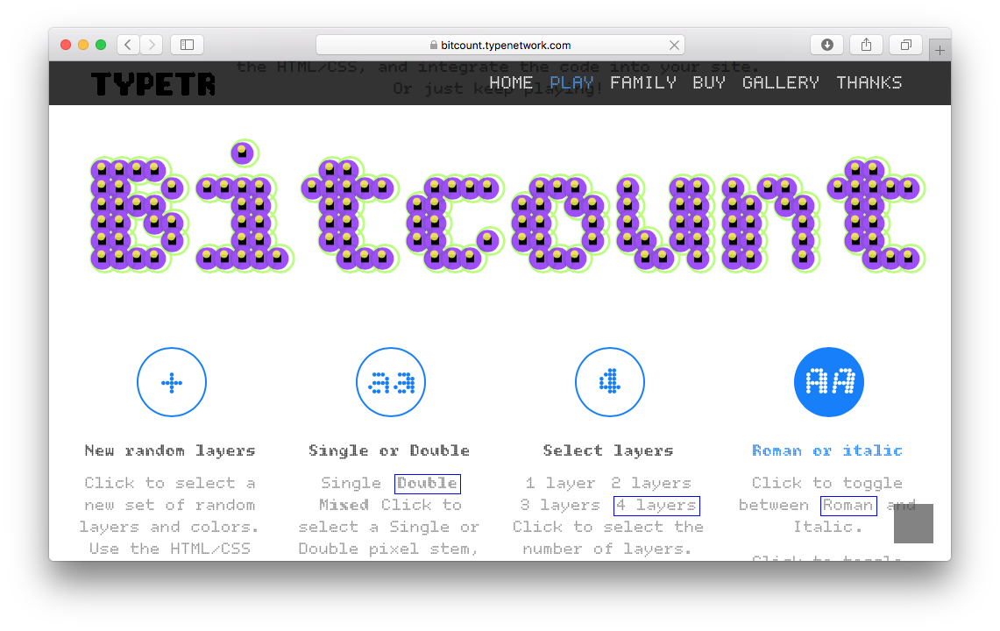
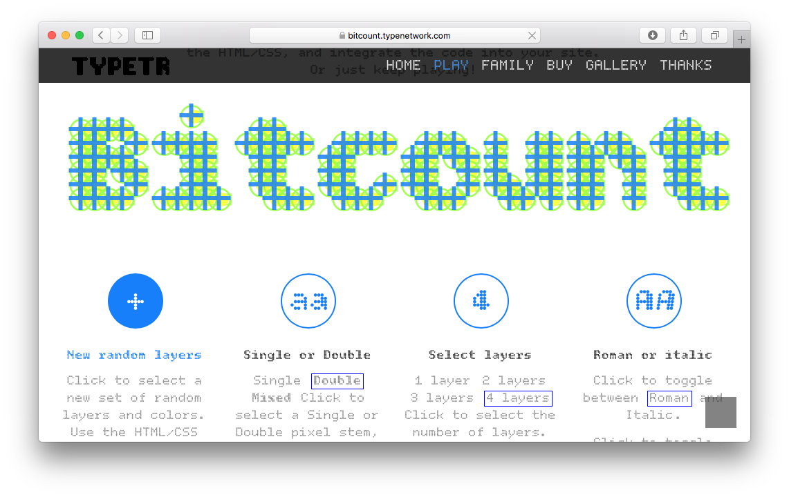
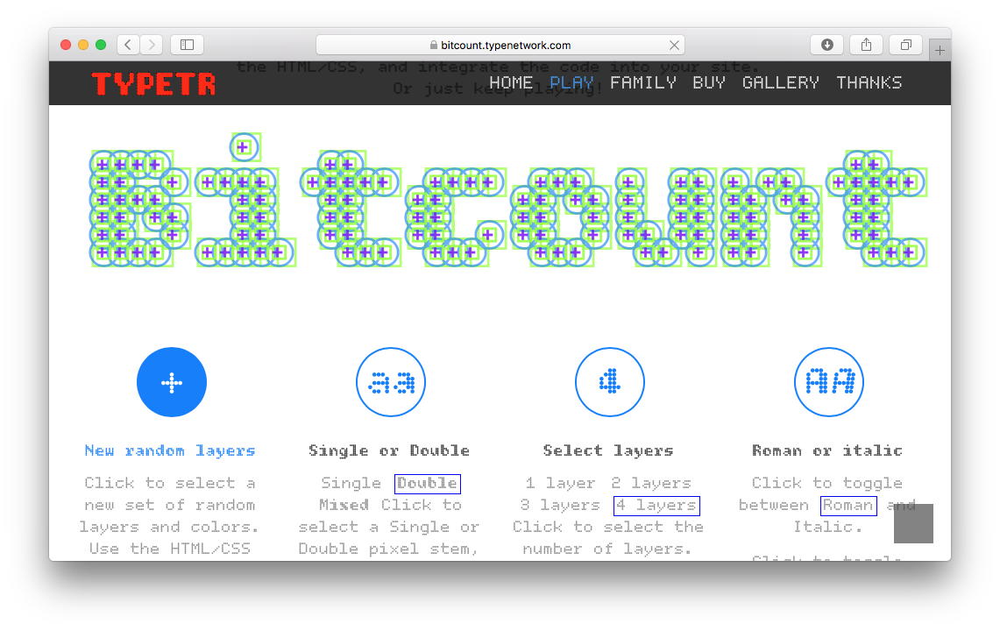

~~~
# ----------------------------------------
# bitcount.html
# ----------------------------------------
page = page.next
page.applyTemplate(template)  
page.name = 'Bitcount'
page.url = 'bitcount.html'

content = page.select('Content')
box = content.newBanner()
~~~
# Bitcount Outline Round [TRY](downloads/Bitcount_Try_Outline-Round.zip)

Try the pre-release of **Bitcount Outline Round** weights. Download the TYPE TRY font package [here.](downloads/Bitcount_Try_Outline-Round.zip)
~~~
# The Bitcount fontDataList is defined by the calling application.
box = content.newTypeList(doc.docLib['fontDataList']['Bitcount Outline Round'], fontSize=44, leading=em(1), labelFont='Upgrade-Regular', labelFontSize=18)

box = content.newBanner()
~~~

# Bitcount Outline Square [TRY](downloads/Bitcount_Try_Outline-Square.zip)

Try the pre-release of **Bitcount Outline Square** weights. Download the TYPE TRY font package [here.](downloads/Bitcount_Try_Outline-Square.zip)
~~~
# The Bitcount fontDataList is defined by the calling application.
box = content.newTypeList(doc.docLib['fontDataList']['Bitcount Outline Square'], fontSize=44, leading=em(1), labelFont='Upgrade-Regular', labelFontSize=18)

box = content.newBanner()
~~~

# Bitcount Outline Square Italic [TRY](downloads/Bitcount_Try_Outline-Square_Italic.zip)

Try the pre-release of **Bitcount Outline Square Italic** weights. Download the TYPE TRY font package [here.](downloads/Bitcount_Try_Outline-Square_Italic.zip)
~~~
# The Bitcount fontDataList is defined by the calling application.
box = content.newTypeList(doc.docLib['fontDataList']['Bitcount Outline Square Italic'], fontSize=44, leading=em(1), labelFont='Upgrade-Regular', labelFontSize=18)

~~~

~~~
section = content.newSection()
box = section.newMain()
~~~
## Compatible with Bitcount Mono

The **Bitcount Outline** series is compatible with the **TYPETR Bitcount Mono**, published by Type Network and available in the Adobe Fonts Library. 

Since the glyphset and the spacing are identical, the **Bitcount Mono** can be mixed with the **Bitcount Outline** in multiple different layers. 

~~~
box = section.newSide()
~~~

Try live examples of **Bitcount Mono** layering <a href="https://bitcount.typenetwork.com" target="external">here.</a>

~~~
section = content.newSection()
box = section.newMain()
~~~
## Supported features

Phasellus rutrum, quam vitae consequat malesuada, mi urna scelerisque est, tempus pulvinar diam metus ut augue. Nam luctus justo et nunc ornare iaculis. Aliquam sollicitudin rutrum nisl, et dictum sem malesuada non. Donec ut nunc eu nibh rutrum molestie at a nisl. Aenean sit amet nibh sagittis, malesuada nisl a, vehicula libero. Morbi lacinia quam ut enim mattis vulputate. Donec finibus in libero in placerat. Praesent rutrum nunc at ultricies egestas.

~~~
box = section.newInfo()
~~~

Phasellus rutrum, quam vitae consequat malesuada, mi urna scelerisque est, tempus pulvinar diam metus ut augue. Nam luctus justo et nunc ornare iaculis. Aliquam sollicitudin rutrum nisl, et dictum sem malesuada non. Donec ut nunc eu nibh rutrum molestie at a nisl. Aenean sit amet nibh sagittis, malesuada nisl a, vehicula libero. Morbi lacinia quam ut enim mattis vulputate. Donec finibus in libero in placerat. Praesent rutrum nunc at ultricies egestas.

~~~
section = content.newSection()
box = section.newMain()
~~~
## Supported glyphs

Sed rhoncus pellentesque eros, in commodo sapien suscipit vel. Proin elit felis, pulvinar ac tellus ut, aliquam eleifend libero. Sed id bibendum metus. Pellentesque tincidunt ligula non quam varius, et luctus neque aliquam. Morbi eget cursus orci. Praesent faucibus placerat massa, a condimentum est pretium pulvinar. Maecenas ultricies sapien id ipsum ultrices sollicitudin. 

### Download the Bitcount Try Outline TTF files.

Note that the TYPE TRY fonts are for review only. Therefor a limited glyphset is implemented as sneak preview. Refer to the Type Network store for a full license, as soon as Bitcount Outline published.

* [Bitcount Try Outline Round](downloads/Bitcount_Try_Outline_Round.zip)
* [Bitcount Try Outline Square](downloads/Bitcount_Try_Outline_Square.zip)

~~~
box = section.newSide()
~~~

ZZZ

~~~
section = content.newSection()
box = section.newMain()
~~~
## Supported weights

Suspendisse eleifend, nisi at imperdiet placerat, eros neque pellentesque metus, vitae interdum odio ante et est. Phasellus tempus consequat est, nec suscipit orci aliquam et. Aenean vitae erat et erat congue gravida. Maecenas fermentum pellentesque tellus, id facilisis neque rutrum et. Vestibulum id nunc nunc.

~~~
section = content.newSection()
box = section.newMain()
~~~
## Pricing

Sed rhoncus pellentesque eros, in commodo sapien suscipit vel. Proin elit felis, pulvinar ac tellus ut, aliquam eleifend libero. Sed id bibendum metus. Pellentesque tincidunt ligula non quam varius, et luctus neque aliquam. Morbi eget cursus orci. Praesent faucibus placerat massa, a condimentum est pretium pulvinar. Maecenas ultricies sapien id ipsum ultrices sollicitudin. 

Phasellus rutrum, quam vitae consequat malesuada, mi urna scelerisque est, tempus pulvinar diam metus ut augue. Nam luctus justo et nunc ornare iaculis. Aliquam sollicitudin rutrum nisl, et dictum sem malesuada non. Donec ut nunc eu nibh rutrum molestie at a nisl. Aenean sit amet nibh sagittis, malesuada nisl a, vehicula libero. Morbi lacinia quam ut enim mattis vulputate. Donec finibus in libero in placerat. Praesent rutrum nunc at ultricies egestas.

[See more about pricing here.](pricing.html)

~~~
box = section.newCropped()
~~~

