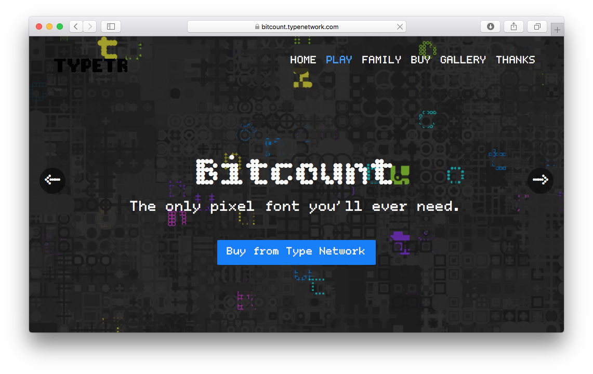
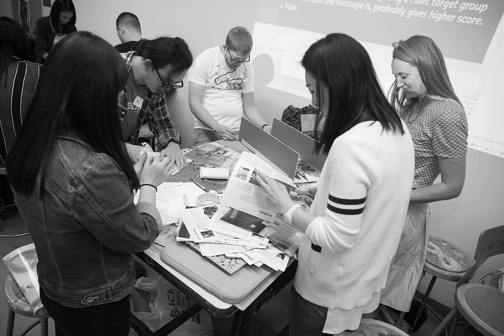
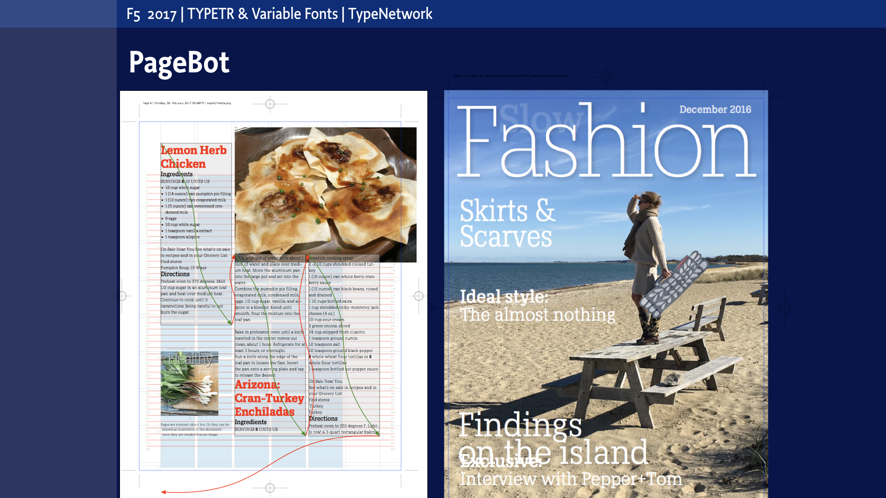
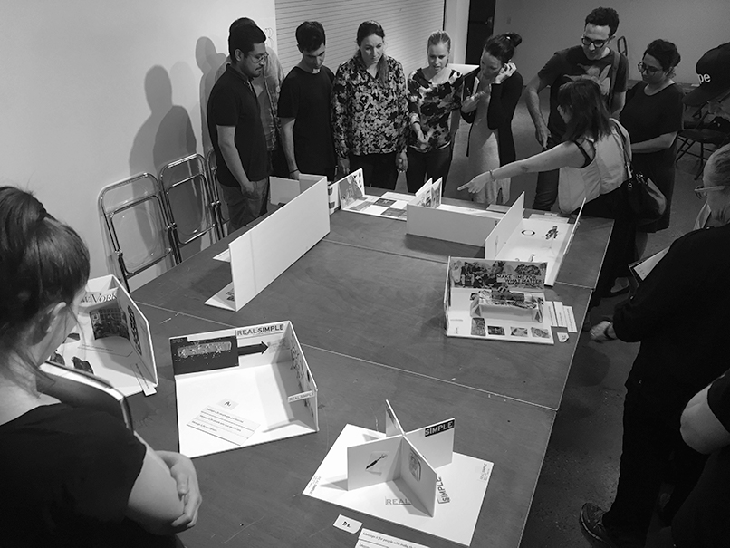

~~~
doc.title = 'TYPE-TRY'
from pagebot.toolbox.units import em

# Uncomment to see cssId/cssClass markers in the page
#doc.view.showIdClass = True

# Page (Home)
#	Wrapper
#		Header 
#			Logo (+BurgerButton)
#			Navigation/TopMenu/MenuItem(s)
#      Content
#  			Banner
#  			SlideShow (on Home)
#      		Slides
#      		SlideSide
#			Section(s)
#				Introduction
#				Main
#				Mains
#					Main
#				Side
#				Sides
#					Side
#		Footer
#
# ----------------------------------------
# index.html
# ----------------------------------------
page.name = 'Home'
page.url = 'index.html'
content = page.select('Content')

box = content.newIntroduction()
~~~
# This site is currently under construction. Contact [buro@petr.com](mailto:buro@petr.com) for additional information.

~~~
box = content.newBanner()
~~~
# Type in the making. Try it now.

~~~
box = content.newCropped(fill=0x561F0C, cssClass='cropped upgrade-try-light-italic')
~~~

# Hi Honey, I’ll buy you a lunch: Fish’n Chips
~~~
box = content.newTypeList(doc.docLib['fontDataList']['Upgrade'], fontSize=44, leading=em(1.1), labelFont='Upgrade-Regular', labelFontSize=18, labelLeading=em(1.4))

box = content.newIntroduction()
~~~

# TYPE-TRY gives an updated overview of running TYPETR projects. Download sample fonts to test in your designs. Use the type, while it is still in the making. Let us know your wishes and suggestions. Find example templates. Get code snippets, that best implement TYPETR type. Or simply order a license by email.

~~~ 
box = content.newCropped()
~~~

~~~
box = content.newTypeList(doc.docLib['fontDataList']['Bitcount Outline Round'], sampleText='Bitcount Outline Round', fontSize=44, leading=em(1.1), labelFont='Upgrade-Regular', labelFontSize=18, labelLeading=em(1.4))

box = content.newTypeList(doc.docLib['fontDataList']['Bitcount Outline Square'], sampleText='Bitcount Outline Square', fontSize=44, leading=em(1.1), labelFont='Upgrade-Regular', labelFontSize=18, labelLeading=em(1.4))

from pagebot.constants import *
slideshow = content.newSlideShow(h=300, slideW='100%', slideH=300, startIndex=3, autoHeight=True, carousel=1, dynamicHeight=False, transition='slide', easing=CSS_EASE, frameDuration=4, duration=0.7, pauseOnHit=True, randomPlay=False, slidesLeft=True)

box = slideshow.slides
~~~

~~~
box = slideshow.side
~~~
### The Three T’s

## Type, Templates & Teaching

TYPETR provides designers a combination of typographic tools: **Typefaces** that live up to the latest technical standards, **Templates** that show how we think those typefaces should be used and **Teaching** to train and program the process of design.

# [Contact us](contact.html)

~~~
section = content.newSection()
box = section.newMain()
~~~
## Use the Open Type features that you need.

Open Type features are not commonly understood. Let’s assume that as typographer you want to use Applications such as InDesign offer a menu for some of the features that are included in fonts. 

---
# One family to fit all usage.

Donec euismod ex in mauris feugiat, quis commodo massa vestibulum. Sed non laoreet tortor. Etiam malesuada sem et odio laoreet, vel accumsan quam auctor. Quisque porta libero nunc, at pellentesque mauris dictum faucibus. Nam nec luctus dolor, a euismod diam. Cras non luctus libero, vitae pharetra mauris. Mauris iaculis laoreet quam eu ullamcorper. Ut et vehicula neque, eget imperdiet diam. Nulla eget vulputate libero. 

---
## How it works

* Mauris sagittis, dui at tristique elementum, sapien tortor accumsan nisi, et blandit eros magna nec arcu. Nulla pharetra rutrum dictum. 
* Vivamus congue turpis nunc, non vestibulum odio aliquet in. 
* Aliquam ut dapibus metus, quis vehicula nulla. 
* Nullam semper erat vel turpis dictum, eget hendrerit mauris convallis.
* Nam vehicula eu nisi eget sodales. Vestibulum non finibus est. Mauris auctor ex purus, id bibendum justo ullamcorper nec. Phasellus placerat mollis elit, ac luctus sem pretium non. Mauris iaculis scelerisque iaculis.  
* Nunc dignissim lectus tortor, vel finibus nibh lobortis vitae. Nunc sagittis euismod tortor, ut tempor dui volutpat at.

[More about pricing.](pricing.html)

~~~
box = section.newSide()
~~~
### Download the Upgrade CJK glyph set as PDF

## Licensing

Aliquam accumsan, velit mollis pellentesque accumsan, orci nulla ullamcorper ligula, imperdiet facilisis quam massa a ipsum. Aliquam vitae aliquet odio. Nulla facilisi. Proin pulvinar nisl quis ipsum vehicula pharetra. Praesent ullamcorper in elit sit amet maximus. 

