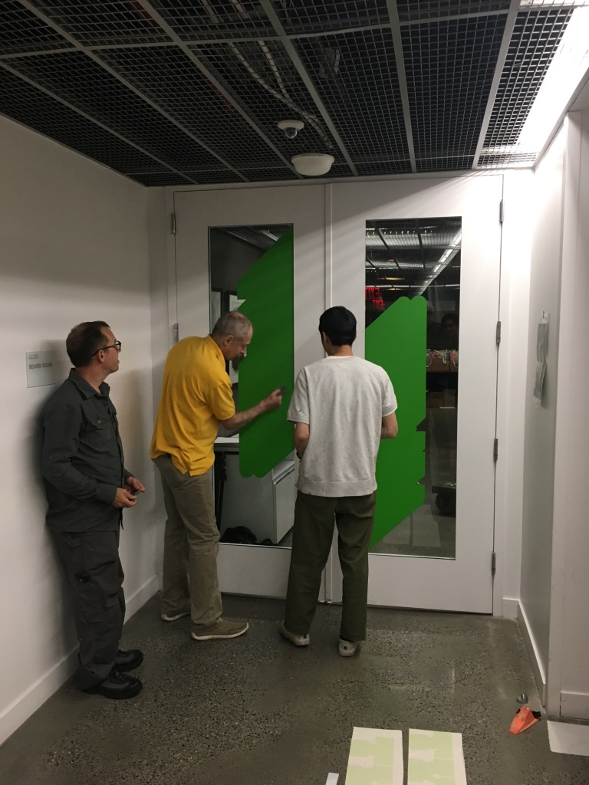

~~~
# ----------------------------------------
# Studies/2018-reviews.html
# ----------------------------------------
page = page.next
page.applyTemplate(template)  
page.name = 'PowerLift'
page.url = 'powerlift.html'

content = page.select('Content')
box = content.newBanner()
~~~
# More TYPETR PowerLift variants in the making. [TRY](downloads/TYPETR-PowerLift_Try.zip) them now.

~~~
box = content.newCropped(fill=0.3, cssClass='cropped cropped-second')
~~~

# Hey Bun, let’s get a Croque Monsieur

~~~
box = content.newIntroduction() # Large color background, white large text
~~~

# [TRY](downloads/TYPETR-PowerLift_Try.zip) the heavy weight PowerLift in your design work. Two variants are released: **PowerLift Tight** and **PowerLift Tight Outline**, matching to be used in layers. Two new variants will be released in 2019: **Circle** and **Slab**.

~~~
from pagebot.toolbox.units import em
box = content.newTypeList(doc.docLib['fontDataList']['PowerLift'], fontSize=120, labelFont='Upgrade-Regular', labelFontSize=18, leading=em(1), labelLeading=em(1.5))

box = content.newBanner()
~~~

# What designers did with the font.

~~~
box = content.newMain()
~~~

~~~
box = content.newSide()
~~~

~~~
box = content.newCropped(fill=0.3, cssClass='cropped cropped-third')
~~~

# Hey Bun, let’s get a Croque Monsieur
